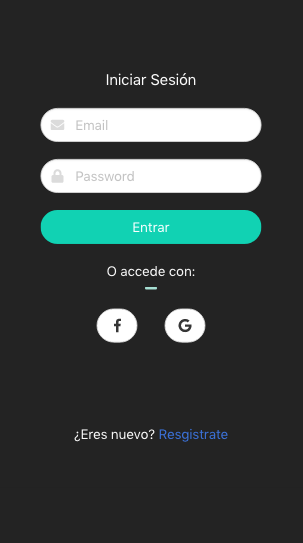

# Microcuentos ilustrados

Microcuentos ilustrados, es una red social colaborativa, que une a ilustradores y escritores aficionados.
Un escritor publica su cuento y algún ilustrador interesado, lo toma para ilustrarlo.

También pueden subir ilustraciones independientes y no todos los cuentos tienen que ilustrarse.

**Ilustraciones tomadas de internet, crédito a quien corresponda**

## Pantalla de inicio

## Login

## Feed para compartir imagenes y microcuentos

## Profile personalizable

